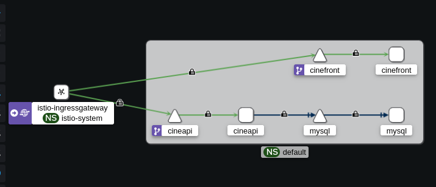

# CineBook - Application de Réservation de Places de Cinéma

## Contexte du projet

CineBook est une application de réservation de places de cinéma développée dans le cadre de l'UE Programmation Web et Distribuée. L'objectif était de concevoir une architecture complète en microservices orchestrée par Kubernetes avec un service mesh Istio, intégrant des mécanismes de sécurité avancés.

L'application permet aux utilisateurs de consulter les films à l'affiche, voir les séances disponibles et réserver des places. Un espace administrateur permet de gérer les films et les séances.

## Architecture technique

L'application est composée de trois services principaux :
- **Backend API** : Flask (Python) - expose les endpoints REST pour la gestion des films, séances et réservations
- **Frontend** : Nginx - sert les pages HTML statiques et communique avec l'API via AJAX
- **Base de données** : MySQL - stocke les informations des films, séances, utilisateurs et réservations

L'orchestration est assurée par Kubernetes avec Minikube, et le service mesh Istio gère le routage, la sécurité et la visibilité des communications.

## Guide d'installation et déploiement

### Prérequis
- Docker
- Minikube
- Kubectl
- Istioctl
- kiali (optionnel)

### Étapes d'installation

1. **Démarrer Minikube**
```bash
minikube start --cpus=2 --memory=4096
```

2. **Activer l'injection Istio**
```bash
kubectl label namespace default istio-injection=enabled --overwrite
```

3. **Se placer dans l'environnement Minikube**
```bash
eval $(minikube docker-env)
```

4. **Lancer le déploiement**
```bash
chmod +x deploy.sh
./deploy.sh
```

5. **Vérifier que tous les pods sont en état Running**
```bash
kubectl get pods -w
```
(peut prendre du temps pour que tout Run correctement sans crash)

6. **Installer Kiali et Prometheus**
```bash
kubectl apply -f https://raw.githubusercontent.com/istio/istio/release-1.24/samples/addons/kiali.yaml
kubectl apply -f https://raw.githubusercontent.com/istio/istio/release-1.24/samples/addons/prometheus.yaml
```

7. **Lancer Kiali**
```bash
istioctl dashboard kiali
```

8. **Accéder à l'application**
```bash
# Version HTTP
./port-forward.sh
# Puis ouvrir http://localhost:8081

# Version HTTPS (nécessite certificats)
./port-forward-https.sh
# Puis ouvrir https://localhost:8443
```

## Sécurité mise en place

Le projet intègre plusieurs couches de sécurité :

### 1. RBAC (Role-Based Access Control)

Chaque service dispose de son propre ServiceAccount avec des permissions limitées au strict nécessaire :

- **cineapi-sa** : peut lire les secrets et lister les pods
- **cinefront-sa** : peut lister les pods
- **mysql-sa** : peut lire les secrets et les persistentvolumeclaims

Les rôles et rolebindings correspondants sont définis dans le dossier `k8s/rbac/`.

### 2. mTLS (mutual TLS)

Toutes les communications entre services sont chiffrées et authentifiées via mTLS en mode STRICT :

- **PeerAuthentication** : impose le chiffrement pour toutes les communications
- **DestinationRule** : configure l'utilisation de mTLS pour les appels entre services

Configuration dans `k8s/mtls/` :
- `strict-mtls.yml` : active mTLS STRICT sur le namespace
- `destination-rule-mtls.yml` : règle globale pour tout le namespace



### 3. HTTPS pour le trafic externe

L'accès à l'application depuis le navigateur peut se faire en HTTPS grâce à :
- Un certificat SSL/TLS généré avec mkcert (recommandé) ou auto-signé
- Une gateway Istio configurée pour écouter sur les ports 80 (HTTP) et 443 (HTTPS)

La redirection HTTP vers HTTPS peut être activée selon les besoins.

### 4. Isolation des données

- Les données MySQL sont persistées dans un PersistentVolume
- Chaque service est isolé dans son propre pod avec des ressources limitées

### Test de l'application
```bash
# Connexion admin
# Identifiants : admin / admin

# Création d'un compte utilisateur
# Réservation de places
# Consultation des réservations
```

## Identifiants par défaut

- **Administrateur** : admin / admin
- **Utilisateur** : à créer via la page d'inscription

## Remarques importantes

- Le déploiement complet prend environ 5-10 minutes selon la configuration
- Les certificats ne sont pas versionnés (voir `.gitignore`)

### Installation et utilisation de mkcert pour HTTPS

Pour éviter l'avertissement de sécurité lié aux certificats auto-signés, nous utilisons **mkcert**, un outil qui permet de créer une autorité de certification locale et de générer des certificats valides et reconnus par le navigateur.


**Installation :**
```bash
# Ubuntu/Debian
sudo apt install libnss3-tools
curl -JLO "https://dl.filippo.io/mkcert/latest?for=linux/amd64"
chmod +x mkcert-v*-linux-amd64
sudo mv mkcert-v*-linux-amd64 /usr/local/bin/mkcert

# Installation de l'autorité locale
mkcert -install
```

**Génération des certificats pour le projet :**
```bash
# Dans le dossier du projet
mkcert localhost 127.0.0.1 ::1
```

**Création du secret Kubernetes :**
```bash
kubectl create -n istio-system secret tls cinebook-certs \
  --key=localhost+2-key.pem \
  --cert=localhost+2.pem
```

**Redémarrage de la gateway :**
```bash
kubectl rollout restart deployment -n istio-system istio-ingressgateway
```

Cette approche permet d'avoir une connexion HTTPS totalement valide et sécurisée en environnement de développement, sans les inconvénients des certificats auto-signés classiques.